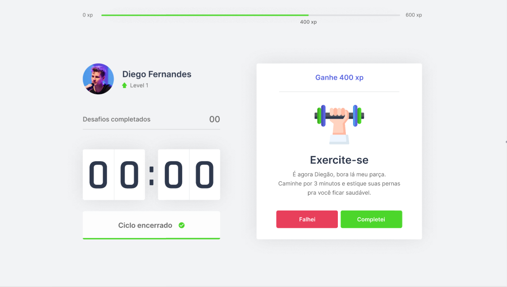

  

<h1 align="center">
    
</h1>

  <a href="#rocket-tecnologias">Tecnologias</a>&nbsp;&nbsp;&nbsp;|&nbsp;&nbsp;&nbsp;
  <a href="#-projeto">Projeto</a>&nbsp;&nbsp;&nbsp;|&nbsp;&nbsp;&nbsp;
  <a href="#-layout">Layout</a>&nbsp;&nbsp;&nbsp;&nbsp;&nbsp;&nbsp;

  
 

 

## 🚀 Tecnologias

Tecnologas utilizadas para fazer o projeto:

- [Next.js](https://nextjs.org/)
- [React](https://reactjs.org)
- [TypeScript](https://www.typescriptlang.org/)

## 💻 Projeto

O Move.it veio com um propósito de trazer motivação na hora de se exercitar! 💜 

Através de um timer, ao completar seu exercicio você ganhará experiência para poder subir de nível e 
desbloquear novas tarefas.

Este é um projeto desenvolvido durante a **[Next Level Week](https://nextlevelweek.com/)**, realizada pela **[@Rocketseat](https://github.com/Rocketseat)** durante os dias 22 a 28 de Fevereiro de 2021.

## 🔖 Layout

Toda interface no qual projeto foi baseado pode ser visualizado através do link:

- [Layout Web](https://www.figma.com/file/ge20pu3ofMOKoliUyKx1Nl/Move.it-1.0)
